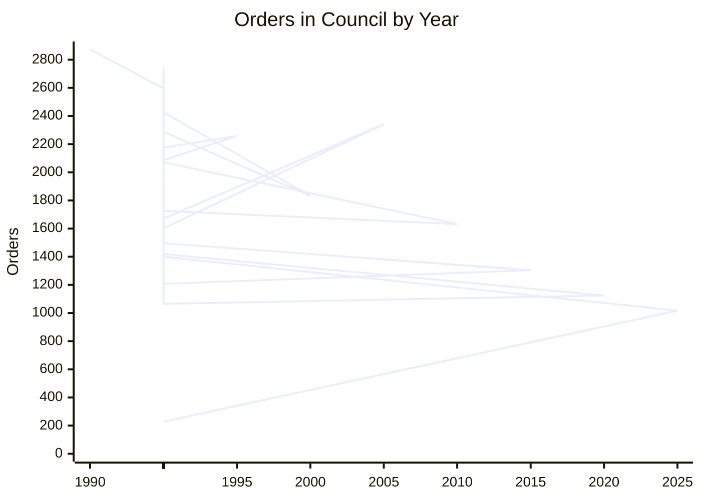
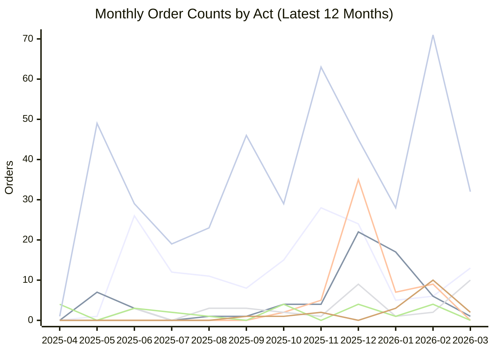

# Canadian federal Order in Council data

<!-- STATUS:START -->
**Latest OIC date:** 2026-03-13
**Last checked:** 2026-03-25 11:40 UTC
<!-- STATUS:END -->

Orders in Council are a key part of Canada’s legal text. They’re a type of delegated legislation, adding additional detail or exercising a specific power from statute or prerogative.

The [Orders in Council (OIC) database](https://orders-in-council.canada.ca/) is great—but it has no export. This makes it difficult to study OICs at scale.

This project mirrors OICs, and their attachments, once a day.

The database’s disclaimer _extra applies_ to this dataset:

> The Orders in Council available through this website are not to be considered to be official versions, and are provided only for information purposes. If you wish to obtain an official version, please [contact the Orders in Council Division](https://www.canada.ca/en/privy-council/services/orders-in-council.html#summary-details3).

## Recent orders

<!-- RECENT_ORDERS:START -->
| Date | PC Number | Department | Act | Subject |
| --- | --- | --- | --- | --- |
| 2026-03-13 | 2026-0244 | JUS | Other Than Statutory Authority | Appointment of a Justice of the Court of King's Bench of Alberta, and a Judge ex officio of the Court of Appeal of Alberta |
| 2026-03-13 | 2026-0243 | JUS | Other Than Statutory Authority | Appointment of a Judge of the Court of King’s Bench of Manitoba |
| 2026-03-13 | 2026-0242 | JUS | Other Than Statutory Authority | Appointment of a Judge of the Court of King’s Bench of Manitoba |
| 2026-03-13 | 2026-0241 | JUS | Other Than Statutory Authority | Appointment of a Regional Senior Judge of the Superior Court of Justice of Ontario for the Central East Region, and a Judge ex officio of the Court of Appeal for Ontario |
| 2026-03-13 | 2026-0240 | JUS | Other Than Statutory Authority | Appointment of a Judge of the Superior Court of Justice of Ontario, and a Judge ex officio of the Court of Appeal for Ontario |
| 2026-03-13 | 2026-0239 | WAGE | Canadian Tourism Commission Act | Reappointment of the Chairperson of the Board of Directors of the Canadian Tourism Commission |
| 2026-03-13 | 2026-0238 | PCH | National Film Act | Appointment of a part-time member of the National Film Board |
| 2026-03-13 | 2026-0237 | PCH | Telefilm Canada Act | Reappointment of a member of Telefilm Canada |
| 2026-03-13 | 2026-0236 | PCH | Museums Act | Designation of the Director of the Canadian Museum of Immigration at Pier 21 |
| 2026-03-13 | 2026-0235 | HC | Canadian Institutes of Health Research Act | Reappointment of a member of the Governing Council of the Canadian Institutes of Health Research |
<!-- RECENT_ORDERS:END -->

## Charts

### Orders by year

<!-- ORDERS_BY_YEAR:START -->

<!-- ORDERS_BY_YEAR:END -->

### Monthly order counts by act

Mermaid XY charts support multiple line series, so this chart shows one monthly series per act in a GitHub-renderable format.

<!-- MONTHLY_ACT_CHART:START -->
Series order: 1. Other Than Statutory Authority; 2. Financial Administration Act; 3. Department of Employment and Social Development Act; 4. Public Service Employment Act; 5. Customs Tariff; 6. Immigration and Refugee Protection Act; 7. Other


<!-- MONTHLY_ACT_CHART:END -->

## How it works

- `scripts/scrape-order-tables.js` uses a headless browser to submit the search form (with no criteria), downloading new results to `order-tables/`
	- creates one JSON file per OIC, containing the HTML of the OIC summary table as a property (`html`)
	- updates `attachment-ids.json` with any new attachments from the new results
- `scripts/scrape-attachments.js` downloads new attachments to `attachments/`
	- ditto JSON approach from the OICs
- `.github/workflows/update-oics.yaml` runs these scripts once a day via GitHub Actions, automatically updating this repository.


## The data

As of July 2022, there are about 62,000 OICs (60.3 MB) and 32,000 attachments (131.1 MB).

A SQLite database can be generated by the GitHub Actions workflow (`Produce CSV from JSON order tables`). When the generated database is 100 MiB or smaller, the workflow commits `processed-csvs/oic-data.sqlite` directly to the repository; otherwise it uploads the database as the `oic-data-sqlite` workflow artifact. The generated DB contains these tables:

- `orders` (`pc_number` primary key)
- `attachments` (`id` primary key)
- `order_attachments` (junction table from `orders` to referenced attachment IDs; retains all references even if attachment content is missing)
- `order_attachments_resolved` (view showing whether each `order_attachments.attachment_id` currently exists in `attachments`)
- `missing_oic_pc_numbers` (known missing OIC numbers)

To create a smaller SQLite export, the build script supports whitespace normalization for both orders and attachments:

- `--order-whitespace preserve`
- `--order-whitespace strip`
- `--order-whitespace collapse`
- `--order-whitespace remove`
- `--attachment-whitespace preserve` (default, no text changes)
- `--attachment-whitespace strip` (trim leading/trailing whitespace)
- `--attachment-whitespace collapse` (collapse all whitespace runs to single spaces)
- `--attachment-whitespace remove` (remove all whitespace characters)
- `--no-secondary-indexes` (skip non-primary-key indexes to reduce file size)

Example compact build:

```bash
python3 scripts/build-sqlite-db.py \
  --db-path processed-csvs/oic-data-compact.sqlite \
  --order-whitespace collapse \
  --attachment-whitespace collapse \
  --no-secondary-indexes
```


## Quirks

- The database seems to shift the comma associated with the “Dept” column depending on the display order—so files in `order-tables` get overwritten with a new `htmlHash`, despite only a comma having changed. This occurs with maximum four OICs per scrape (because five are displayed on each search result page, and the scraper stops if it recognizes all five).
- The tool doesn’t really handle changes to past OICs. But my (very strong) hunch is that they don’t change. You could adjust this tool to monitor all results regularly, using `htmlHash` to detect a change, but, well, see the comma issue above.


## Where to go from here

Import the data directly and use it as you see fit. Or, use the complementary [`lchski/oic-analysis`](https://github.com/lchski/oic-analysis) project (written in R) to extract meaningful information from these raw data, enabling analysis. Feel free to credit / link to this repository if you can, and make sure to mention that the information is originally from the Order in Council Division’s [Orders in Council database](https://orders-in-council.canada.ca/).
